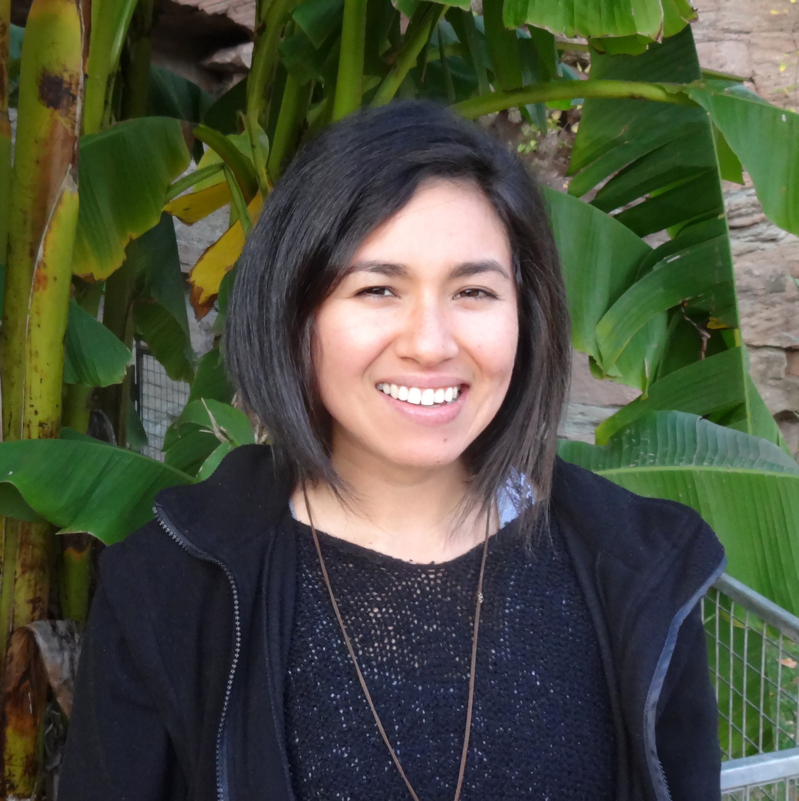
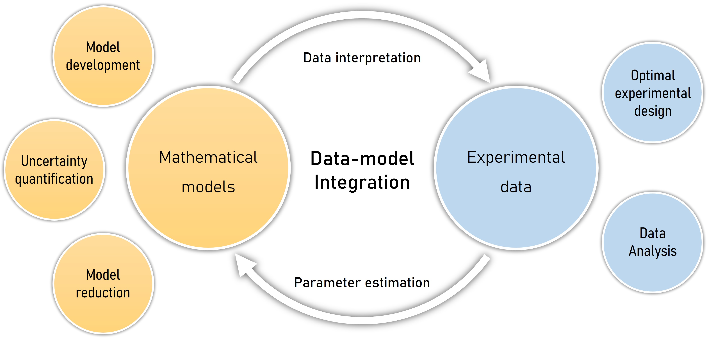

My name is 	**Luciana Chávez Rodriguez** and I am an assistant professor in the [Soil Biology Chair group](https://www.wur.nl/en/research-results/chair-groups/environmental-sciences/soil-biology-group.htm) at Wageningen University & Research, working on integrating the role of soil biota in biogeochemical models. Prior to this position, I was a postdoctoral scholar at the University of California, Irvine. I was a member of the [Allison Lab](https://allisonlab.bio.uci.edu/), working on integration of field and laboratory data into statistical and mechanistic models.

I did my Ph.D. (Dr. agrar.) at the [department of biogeophysics](https://biogeophysik.uni-hohenheim.de/en) at the University of Hohenheim, Stuttgart, Germany, where I worked on modeling microbial processes of pesticide degradation in soils. I received my masters degree, also from the University of Hohenheim, in Environmental Protection and Agricultural food production.

I also hold a bachelor and diploma degree in environmental engineering at the Universidad Nacional Agraria la Molina in Lima, Peru. The main focus of my engineering degree was on environmental pollution. In my diploma thesis about phytoremediation, I identified native plant species with the capability of extracting and accumulating lead from polluted soils. 

{width=50%}

See [here](CV_chavez_rodriguez_2024.pdf) for my complete CV.

## Research interests

I am a soil modeler convinced that models and data complement each other and should be both included in projects. In my research, I use data-model integration techniques to describe the processes occurring in complex systems. 

{width=85%}

My research focuses mainly on modeling microbial processes that mediate biogeochemical cycling in soils. It includes the development of conceptual and mathematical models as well as validation of model assumptions with data. To obtain the necessary data, I use data scavenging and I team up with experimentalists. Through models, I can help not only with data interpretation, but also guide data collection and experimental setups by using optimal design of experiments techniques. 

