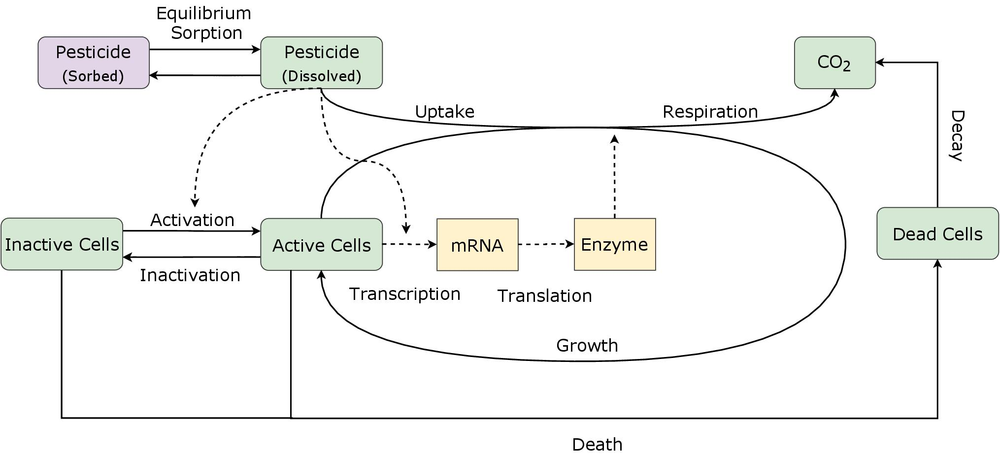
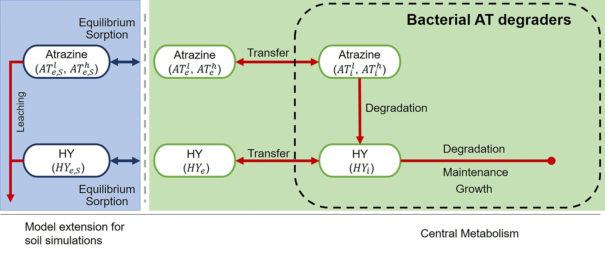
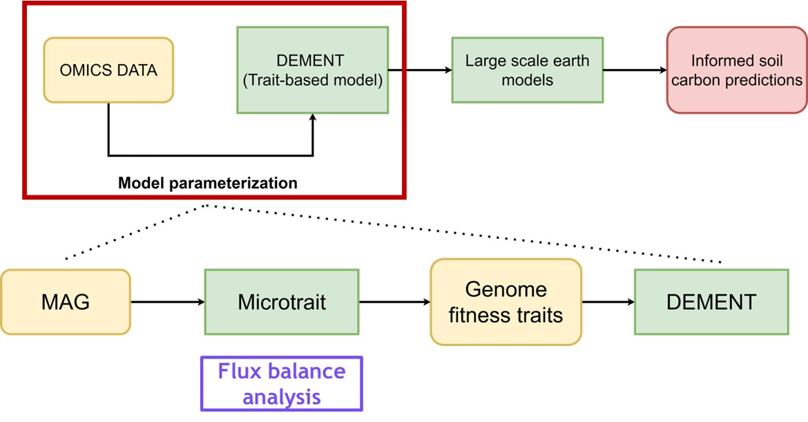

## **Model Development and Uncertainty Quantification**

### **Microbial regulation of pesticide degradation in soils**

I explored the role of i) regulated gene expression, ii) mass-transfer process across the bacterial cell membranes, iii) bioenergetic constraints, and iv) environmental factors (soil temperature and moisture).

**Regulated gene expression** 

Gene-centric models, explicitly incorporating gene and enzyme expression, predict pesticide mineralization as good as the standard Monod model. Additionally accounting for pesticide-triggered gene regulation, allow us to better capture microbial dynamics during pesticide mineralization. This way, the gene-centric models could be used to explore the relationship between transcription of functional genes and process rates, thereby offering an advantage over the standard Monod model.

{width=50%}

**Mass-transfer process across the bacterial cell membranes and bioenergetic constraints**

I targeted the pesticide atrazine, which is highly persistent. The model included mass-transfer process via passive diffusion and bioenergetic constraints via transition state theory. Additionally, equilibrium sorption and leaching fluxes were added to better simulate soil processes. My results point out that sorption limited bioavailability could explain the long-term fate and persistence of the main degradation metabolite hydroxyatrazine. However, my model overestimated the long-term biodegradation of atrazine in soils, indicating that more processes than bioavailability are regulating atrazine degradation.

{width=50%}

**Environmental factors (soil temperature and moisture)**

Through a combination of lab experiments and modeling, I investigated MCPA degradation under different soil temperature (10°C and 20°C) and moisture (pF 1.8 and 3.5) regimes, and substrate concentrations (1 and 20 mg/Kg). M results show that microbial degrader populations degrade the pesticide even in colder and drier soils and at low substrate concentrations. By measuring and simulating a higher carbon use efficiency (CUE), I could confirm that microbial degraders are able to cope with such limiting conditions by allocating more carbon to their biomass as a result of potential physiological adaptation. Therefore, extreme environmental conditions are unlikely to explain pesticide persistence in soils.

{width=50%}

## **Parameter Estimation**

### **Omics data into trait-based models**

Trait-based models have been used to explore the effects of changes in environmental conditions on microbial community assembly and the subsequent effects on soil biogeochemical processes. However, in order to use trait-based models for predictions, robust model calibration, as well as validation against empirical measurements, are needed. Typically, model parameter values are retrieved from physiological laboratory assays. However, these assays are limited to the culturable minority of soil microbiome taxa. In this context, omics data emerge as a rich data source to estimate trait values for a larger portion of the soil microbiome. This data-model integration pipeline, we expect to strengthen model predictions for these environments.

{width=50%}

## **Optimal design of experiments**

The lack of informative data for the validation of model processes hampered model development. Therefore, in the fourth part of this thesis, I used atrazine with its rather complex degradation pathway to apply a prospective optimal design method to find the optimal experimental designs to enable us identifying the degradation pathway present in a given environment. The optimal designs found suggest to prioritize determining metabolites and biomass of specific degraders, which are not typically measured in environmental fate studies. These data will lead to more robust model formulations for risk assessment and decision-making.

{width=50%}

## **Data Analysis**

