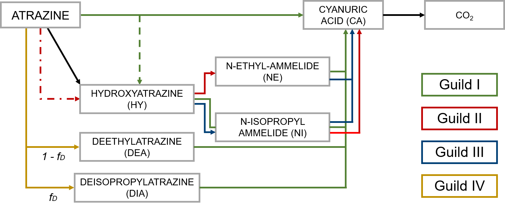

 <h1>**Understanding the role of soil microorganisms in biogeochemical processes under global change** </h1> 

**Global change** (encompassing climate change and pollution) is threatening natural ecosystems and human societies. Understanding and predicting how global change will affect these systems is crucial to **designing adaptation and mitigation strategies**. The soil biota helps provide multiple ecosystem services, and they can either buffer the effects of global change or increase their impact. Therefore, my work aims to:

1) improve the representation of **microbial** and **biogeochemical** **processes** in **soil models** across **scales** and, 
2) **quantify** and **reduce prediction** uncertainty of soil biogeochemical models under global change. 

Using bottom-up and top-down strategies, I will explore the following research questions:

### 1. What level of complexity of microbial-driven processes do we need to represent in soil biogeochemical models?

I am developing a **pipeline** that combines **omics data**, in the form of metagenome-assembled genomes (**MAGs**), with **trait-based models** (Figure 1). I am using **MAGs** in combination with **gene-annotation** tools (using the tool microTrait) and **flux balance analysis** to derive: i) fitness traits, ii) trait abundances under different environmental stressors (i.e., drought or fire), iii) emergent putative functional guilds, iv) emergent trait tradeoffs and v) kinetic parameters.

{width=75%}

### 2. What microbial processes should be incorporated into mechanistic models addressing global change?

I developed genetic trait-based models by integrating molecular biology data into a mechanistic model, exploring the role of:

i) regulated gene expression (Chavez Rodriguez et al., 2020), 

ii) mass-transfer across the bacterial cell membrane and bioenergetic constraints (Chavez Rodriguez et al., 2021), 

iii) environmental factors (soil temperature and moisture) in pesticide degradation in soils (Wirsching et al., 2023). 

This workflow can similarly be used to **mechanistically** assess the role of different processes in the **degradation** of harmful **xenobiotics** like antibiotics or micropollutants in soils and their potentially harmful effects on soil ecosystems.

### 3. How can we reduce the uncertainty of soil biogeochemical model predictions and optimize resources?

I used atrazine degradation to apply a **prospective optimal design** method to find the best **experimental designs** that enable us to identify its degradation pathway present in a given environment (Chavez Rodriguez et al., 2022). The optimal design suggested **prioritizing metabolites** and biomass of specific degraders, which are not typically measured in environmental fate studies.

{width=75%}

### 4. How do we incorporate our knowledge across scales?

Using top-down approaches, we found that climate variables are insufficient to predict $CO_2$ emissions from woody debris decomposition, and information on local wood traits and microbial and insect activities is essential to be incorporated into ecosystem models for robust predictions.  

{width=75%}

