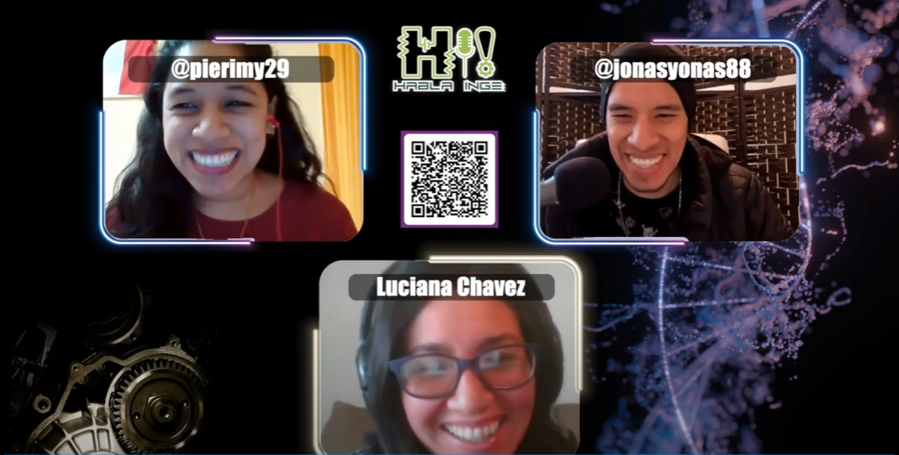

## Teaching

- Introduction to environmental modeling: [sample material](https://github.com/Luciana-cloud/kinetic_modeling)

- Parallel programming exercises (introduction, CPUs and GPUs): [sample material](https://github.com/orgs/CPAR-INICTEL/repositories)

## Outreach

- [Sisay Mentores](http://sisay-mentores.org/sobre-el-proyecto/) 

I am advocating to mentoring STEM undergrad students from my country Peru to show them that research could be an option for them too. The Sisay program aims to connect working professionals and research with Peruvian students, especially from public universities. I am actively participating in this program since 2022. 

One of my mentees got a scholarship for a short stay at the University of Alberta this year. You can read the complete story [here](http://sisay-mentores.org/he-tenido-un-guia-confiable-en-cada-paso-del-camino/). 

- [Cientificos.pe](https://www.cientificos.pe/) 

To avoid misinformation and contribute to scientific communication in Peru, since 2022, I am collaborating with Cientificos.pe with their [Peruvian paper](https://www.cientificos.pe/?page_id=6193) initiative. Here, we collect papers authored by Peruvian scientist, summarize them and tweet them in a simple manner. The idea is give visibility to Peruvian scientist around the world and pitch their work to the broader public. 

Check out my very first interview about my experience in academia en Español !!!

[{width=50%}](https://www.youtube.com/watch?v=CQbDsJ4D5XI)

